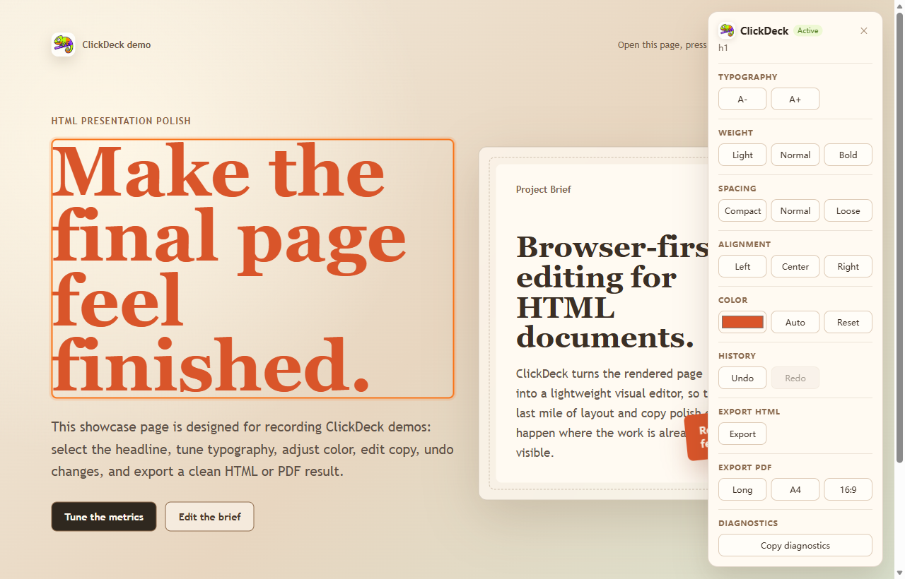

# ClickDeck 案例研究：把 AI 生成的 HTML 变成可编辑的演示材料

_A case study on editing AI-generated HTML artifacts as presentation material_

## 摘要

ClickDeck 是一个开源 Chrome/Edge 扩展，面向已经在浏览器中渲染出来的 HTML 页面做可视化编辑。它的重点不是生成第一版页面，而是在 AI 已经生成初稿之后，让用户继续判断哪些字需要改、哪些图片需要替换、哪些层级需要调整，以及最终应该导出成什么形式。

这类工具之所以有意义，是因为 AI 生成 HTML 的速度已经足够快，但“可以看”和“可以交付”之间仍然有明显差距。对于演示稿、项目说明页、静态落地页或者 HTML 形式的报告来说，人工修订往往不是大幅重写，而是一系列视觉和表达层面的微调。ClickDeck 的价值，就在于把这轮微调从代码层移到页面本身。

这份文档写成介绍性案例文章，而不是操作说明。它会把 ClickDeck 的定位、问题背景、典型流程、项目事实信息和判断性结论放在同一篇文档里，适合作为后续 PDF 化材料导入 Lens，用来展示目录导航、Explain、Summary、Bullets、表格预览、图像预览以及基于原文生成 Note 的过程。

## 一、ClickDeck 的定位

ClickDeck 当前版本为 `1.3.2`，从仓库里的 `package.json`、Manifest V3 配置以及 README 可以确认，它是一个运行在当前页面上的浏览器扩展，而不是独立的桌面编辑器。它主要依赖 `activeTab`、`scripting` 和 `storage` 权限，在正常网页、本地 HTML 或演示型页面上工作，通过 content script 把编辑能力直接叠加到已渲染的 HTML 上。

从已有功能命名看，ClickDeck 的定位并不模糊。它支持页面元素选择、文字与样式微调、图片替换、撤销重做、浏览器演示模式、HTML 快照、长图、图片型 PDF，以及两类很有代表性的协作能力：一类是 **Copy AI Edit Prompt**，把视觉修改转成结构化 prompt；另一类是 **Review Prompt Handoff** 与页面级“修改意见”，把用户能看出来但不想手写成技术描述的问题，转成更适合继续交给外部 AI 的输入。

这说明 ClickDeck 不是“重新设计页面”的工具，也不是“自动回写源码”的工具。更准确的描述是：它承担的是 AI 生成 HTML 之后的人工控制层，让页面从一个初稿产物变成一个更接近可展示、可说明、可交付的材料。

## 二、为什么 AI 生成 HTML 之后仍然需要人工编辑

AI 生成 HTML 的能力解决了第一阶段的问题：用户不用从空白页面开始，可以快速得到一个结构完整、信息基本齐全的初稿。对于产品介绍页、项目说明页、演示稿样式页面甚至轻量文档页来说，这一步已经大大缩短了从想法到页面的距离。

但第二阶段的问题并没有被自动消除。页面的重点是否清楚，标题是否过弱，段落是不是过长，图片是不是贴题，某些词语是否需要收紧，某一页是否可以直接拿来展示，这些判断仍然需要人来完成。很多时候，用户并不是想重新提示 AI 再生成一版，而是希望在“已经差不多对了”的页面上继续做最后的修订。

如果这一步仍然要求用户打开 DevTools、找 DOM 节点、调 CSS、猜选择器，那么 AI 生成带来的效率就会被重新抵消。ClickDeck 要处理的，正是这个非常具体但普遍存在的缺口：AI 负责生成第一页，人负责把这一页变成真正可用的版本，而编辑界面应该尽可能贴近页面本身。

## 三、English Source Block

An AI-generated HTML artifact is not just a static web page. It is an editable communication object created by a language model, reviewed by a human, and often reused as a presentation, report, or product explanation. The first version can be produced quickly, but the final version still depends on human judgment. Users usually need to revise wording, replace images, adjust visual emphasis, and decide how the material should be delivered. In many workflows, the problem is not generation but revision: once the page exists, people want to keep the structure, preserve context, and make targeted changes without restarting the whole process. A useful editing layer should therefore work directly on the rendered result, support inspection and correction, and leave room for later export or AI handoff. That is why a visual HTML editor can become an important bridge between model output and real presentation material.

## 四、ClickDeck 的典型使用流程

一个比较常见的流程是：用户先用通用 AI 或代码模型生成一版 HTML 页面，把它当成演示页、项目说明页或内容草稿；然后直接在浏览器中打开，先检查结构、图文关系、强调层级和整体观感；接着通过 ClickDeck 在页面上直接改字、调大小、换图、补充“修改意见”，把看得出来但还没被说清楚的问题落到具体区域上；最后，再根据用途决定导出为 HTML 快照、长图、图片型 PDF，或者保留为浏览器演示页面继续展示。如果还需要进一步回到源码层，则可以把当前页面状态整理成结构化的 edit / review prompt，继续交给外部 AI 或开发者处理。这一整段适合在阅读界面里做 Bullets，因为它本质上描述的是一个完整但连续的工作流。

## 五、项目信号表

下表只保留目前可以确认，或明确标记为待补的数据。这里的作用不是做“宣传指标展示”，而是给读者一个快速了解项目状态、入口和阶段的事实卡片。

| 项目 | 内容 |
| --- | --- |
| 项目名称 | ClickDeck |
| 产品类型 | Chrome / Edge 扩展 |
| 当前版本 | 1.3.2 |
| GitHub 仓库 | https://github.com/ningsiii/ClickDeck |
| GitHub Stars | TODO：录制前填写当前数据 |
| Chrome Web Store | https://chromewebstore.google.com/detail/clickdeck/dejmgkhjgibolmfhfpgacfhpoindohmg?hl=zh-CN |
| Chrome Web Store 用户量 / 评价数 | 400+（用户提供，录制前建议再核对） |
| Lens 项目地址 | https://github.com/ningsiii/Lens |
| 更多演示或主页入口 | TODO：录制前补充 |
| 当前阶段 | Early MVP / 持续迭代中 |
| 许可证 | MIT |

## 六、产品界面与展示材料

下面这张图可以作为文档中的主图。它的作用不是精确说明每一个操作，而是让读者先形成对 ClickDeck 视觉形态的直觉：这是一个在浏览器里直接工作的轻量编辑层，而不是一个脱离页面的独立设计工具。

图 1：ClickDeck 的界面示意图。后续如果你希望把 Chrome Web Store 页面截图或 GitHub 仓库首页截图也加入视频材料，可以插在这一节后面，但正文本身不必依赖那些截图才能成立。

## 七、ClickDeck 所面对的实际问题

ClickDeck 面对的实际问题并不复杂，但很典型：AI 已经越来越擅长生成第一版页面，可第一版并不自动等于最终版。用户真正反复消耗时间的，往往不是从零开始搭内容，而是在已有结果上继续判断、修正、重排、强调和导出。页面里的很多问题并不是“完全错误”，而是“差一点就能用”，而这一点差距通常只能由人来决定。

真正困难的地方，不是让 AI 生成第一版页面，而是让人能够在不重新改代码的情况下，继续判断、修正和交付这份材料。

这段话本身就适合作为 Note 的来源。它既不是口号，也不是功能清单，而是一个对 AI 工作流的具体判断：生成速度提高之后，编辑界面和重构界面会比单纯的生成按钮更重要。对 ClickDeck 来说，这个判断解释了它为什么存在；对阅读者来说，这也提供了一个理解类似工具的角度。

## 八、结论

如果把 ClickDeck 放回更大的工作流里看，它最值得注意的地方，不是“它能不能取代 PPT”或者“它是不是另一个网页编辑器”，而是它把 AI 生成 HTML 之后常常被忽视的一段人工工作显式化了。它让用户不必马上回到源码，也不必完全依赖重新提示 AI，而是在浏览器里直接接管这一份已经成形的材料。

从这个角度说，ClickDeck 的意义不在于扩大 AI 的生成能力，而在于承认一个更现实的事实：未来的内容生产中，生成会越来越便宜，但理解、修正、组织和交付仍然需要更好的界面。这也是为什么一篇关于 ClickDeck 的介绍文档，本身可以成为一个很好的阅读与标注样本。

## 附：项目链接

- ClickDeck GitHub：<https://github.com/ningsiii/ClickDeck>
- Lens GitHub：<https://github.com/ningsiii/Lens>
- ClickDeck Chrome Web Store：<https://chromewebstore.google.com/detail/clickdeck/dejmgkhjgibolmfhfpgacfhpoindohmg?hl=zh-CN>
- 更多演示或视频主页：TODO：录制前补充
